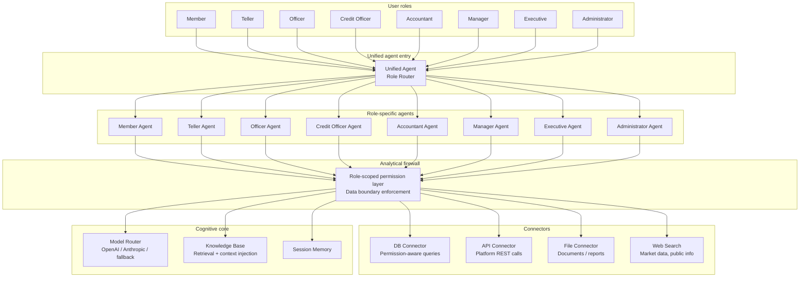
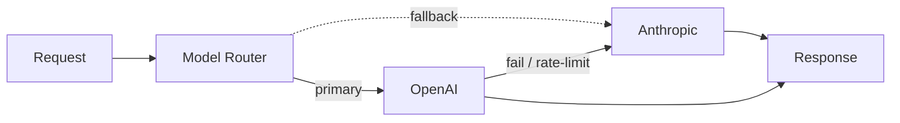

# KPee AI — Role-Scoped AI Agent System

> An in-product AI assistant for [KPee](https://github.com/Afrifa518/kpee-platform-overview), the cooperative management platform I built for Kibbutz Pishon Ltd. Eight role-specific agents, multi-provider LLM routing with fallback, permission-aware retrieval, and an analytical firewall that enforces data boundaries.

> **About this repository** — Public architecture overview. The production code is private. The designs, diagrams, and decisions below are what's actually shipping.

---

## The problem

KPee has ten distinct user types (members, field officers, savings/loan/trade staff, ops managers, platform admins, vendors, aggregators, transporters). Each one needs a different kind of help from an AI assistant — and each one must only see data they're authorised to see.

A single "generic assistant" would have been easy but wrong. A cooperative member asking "what are my recent savings?" and a platform admin asking "how much margin did we realise last month?" need fundamentally different tools, different context, and different data scopes.

So I built KPee AI as **8 role-specific agents**, each sharing a common spine but each with its own prompt, tools, and retrieval scope. Every agent runs through an **analytical firewall** that enforces the same permission boundaries the rest of the platform uses.

---

## System architecture

---

## Design pillars

### 1. Role-scoped agents

Each role has its own agent with a purpose-built system prompt and a curated tool set. A member's agent can check their own savings balance; it cannot query the society-wide ledger. A teller's agent can post deposits but cannot approve loans. An executive's agent can read aggregated analytics across the whole platform.

This isn't runtime filtering — it's tool-level: tools that would expose out-of-role data simply aren't attached to the agent in the first place.

### 2. Analytical firewall

Even within an authorised tool, the **firewall layer** injects the caller's role + identity into every DB query so RLS-style constraints are enforced at the SQL layer. A tool that reads "transactions" returns transactions the caller can actually see — not "all transactions." This is the same isolation model the rest of KPee uses; the AI just inherits it.

### 3. Multi-provider LLM routing with fallback

Calls go through a unified LLM client interface (standardised across providers). If the primary provider fails or hits a rate limit, the router transparently falls back to the secondary. The interface is shaped so that adding a new provider (Google, Mistral, local) is a one-file change.

### 4. Knowledge base with default-context injection

Each agent has a role-scoped knowledge base: documentation, policy docs, FAQs, and domain references relevant to that user type. A small **default context** is injected into every prompt so the agent doesn't have to "figure out" who it is or what platform it's part of on every turn — that's baked in.

### 5. Session memory

Each session maintains its own short memory window — recent turns, intermediate tool results, running state — without polluting the long-term knowledge base.

---

## The 8 agents

| Agent | Role | What it can do |
|---|---|---|
| **Member Agent** | Cooperative member | Check balances, recent savings/loan activity, next payment due, share dividends |
| **Teller Agent** | Teller / cashier | Post deposits / withdrawals, look up member by phone, check daily totals |
| **Officer Agent** | Savings officer | Enroll members, verify KYC, run association-level reports |
| **Credit Officer Agent** | Loans officer | Loan application triage, repayment schedules, arrears reports |
| **Accountant Agent** | Accountant | GL queries, trial balance, transaction drill-downs, settlement status |
| **Manager Agent** | Society manager | Operations dashboards, staff performance, monthly society reports |
| **Executive Agent** | Society exec / board | Aggregated analytics, period-over-period comparisons, strategic views |
| **Administrator Agent** | Platform admin (Kibbutz Pishon) | Cross-society analytics, marketplace operations, investor / partner flows |

There's also a **Unified Agent** that acts as the entry point: based on the caller's authenticated role, it routes to the right role-specific agent.

---

## Connectors

| Connector | Purpose |
|---|---|
| **DB Connector** | Permission-aware SQLAlchemy queries against the KPee PostgreSQL database |
| **API Connector** | Calls into the KPee REST API when the agent needs to trigger an action (not just read) |
| **File Connector** | Reads structured documents (member orientation manuals, policy docs, reports) |
| **Web Search Connector** | For market data, commodity prices, public information outside the platform |

---

## Key implementation details

- **Unified LLM interface** — every provider sits behind the same client contract, so agents are provider-agnostic. The router chooses at call time based on availability and cost.
- **Provider fallback is standardised** — the unified agent/provider-fallback layer ensures every agent gets the same retry/fallback semantics. No agent has to reimplement resilience.
- **Default context injection** — every agent call silently prepends role context, platform context, and knowledge-base retrieval so the prompt itself stays focused on the user's actual request.
- **Routing refactor** — the agent routing layer is factored so adding a 9th or 10th agent (e.g., for a new role) is a file + a prompt + a tool list, not a rewrite.
- **Integrated into 10 frontends** — every frontend has its own `lib/kpeeai/` directory wiring the chat UI into the unified entry point. One backend, ten entry points, each seeing only what its role should see.

---

## What this project demonstrates

- **AI as a product capability, not a demo** — it ships inside a live platform, authenticated, permission-bounded, and used by people who are not prompt engineers.
- **Serious attention to data boundaries** — the analytical firewall is the same boundary the rest of the platform enforces. The AI layer isn't an exception.
- **Provider-agnostic design** — multi-provider routing, unified client interface, standardised fallback. Doesn't hard-couple to any vendor.
- **Role-awareness baked in** — 8 purpose-built agents instead of one over-provisioned generalist. Each one is cheaper to run, safer to deploy, and easier to reason about.

---

## Contact

**Afrifa Yaw Ankamah** — CTO, Kibbutz Pishon Ltd
📧 afrifabusiness518@gmail.com · 📱 +233 50 968 7490 · 📍 Accra, Ghana

Open to remote backend / full-stack / AI-systems engineering roles. [github.com/Afrifa518](https://github.com/Afrifa518
